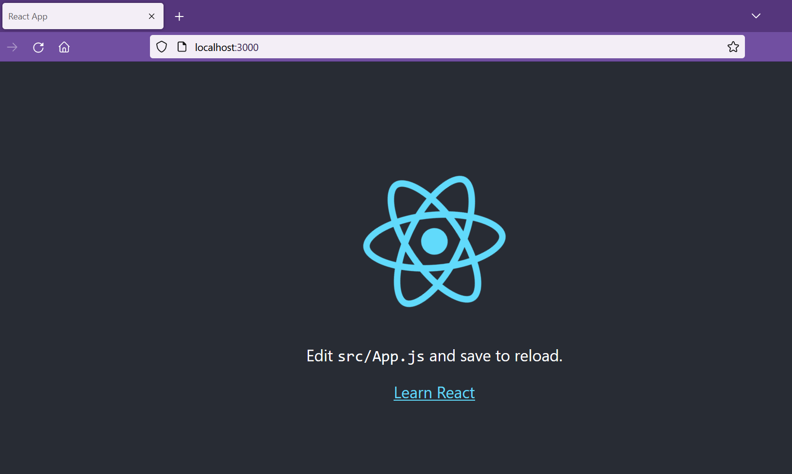
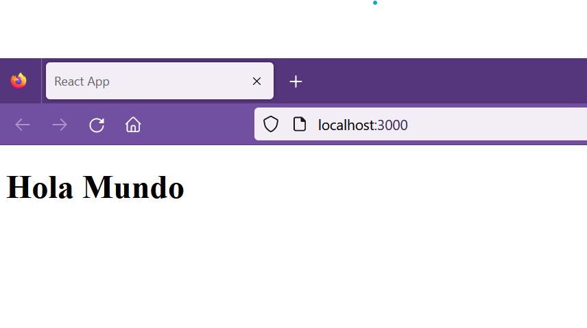
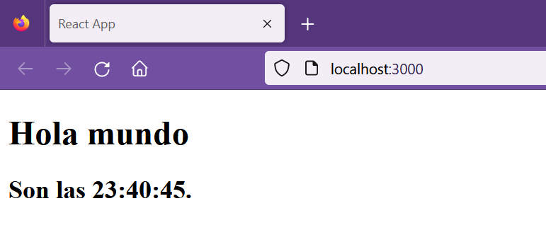

## Hands on exercise

[Regresar](/CodingBootcampsESPOL-FPR/)


* En la sección de [node y npm](./nodeJs-npm.md) habíamos creado la carpeta **FPR-apps** así que abriremos la terminal en ese ruta. Y ejecutaremos el siguiente comando para crear nuestra aplicación con React.

```
npx create-react-app myfirstapp
```

* Una vez finalizada la instalación, la aplicación se crea dentro de una carpeta con el nombre especificado, en este caso es de **myfirstapp**. Cambie a esa carpeta ejecutando el siguiente comando.

```
cd myfirstapp
```

* Ejecutando el siguiente comando verificaremos que nuestra aplicación en React se ha creado. Esto iniciará el servidor de desarrollo de React en el puerto 3000.

```
npm start
```

<p align="center">

</p>

* Si deseas detener la ejecución del servidor presiona Ctlr+C en la terminal.

Hola Mundo
===========

* * *

* En la carpeta src de la carpeta del proyecto myfirstapp, encontrará el archivo index.js en el que insertará el siguiente código.

```js
import React from 'react';
import ReactDOM from 'react-dom/client';
import App from './App';

const root = ReactDOM.createRoot(document.getElementById('root'));
root.render(
    <App />
);
```

* Reemplazaremos el contenido de App.js dentro de la carpeta src, con el siguiente código.

```js
function App() {
  return (
      <h1>Hola Mundo</h1>
  );
}

export default App;
```

* Para esta práctica será necesario eliminar algunos archivos, por eso ejecute el siguiente comando.

```
rm src/App.css src/App.test.js  src/index.css src/logo.svg src/reportWebVitals.js  src/setupTests.js
```

* Inicie el servidor con el comando mencionado anteriormente.

```
npm start
```
En el navegador visualizará la página renderizada con el mensaje "Hola Mundo".

<p align="center">

</p>

Hola Mundo con el tiempo
===========

* * *

* Cambie el código en **App.js**, pegando el siguiente código en él. Representará la marca de tiempo junto con el mensaje Hola mundo.

```js
function App(props) {
  const currDate = new Date();

  return (
    <div>
      <h1>Hola mundo</h1>
      <h2> Son las {currDate.toLocaleTimeString()}.</h2>
    </div>
  );
}

export default App;
```

* Para mantener la actualización de la hora y que cambie constantemente, modifique el código en index.js pegando el siguiente código.

```js
import React from 'react';
import ReactDOM from 'react-dom/client';
import App from './App';

const root = ReactDOM.createRoot(document.getElementById('root'));
function ref() {
  root.render(<App/>);
}

setInterval(ref, 1000);
```

* Inicie el servidor nuevamente y verifique las modificaciones.

<p align="center">

</p>