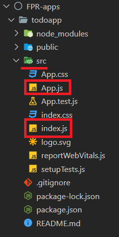

## NodeJS y NPM

[Regresar](/CodingBootcampsESPOL-FPR/)

Antes de iniciar con React, debemos instalar [Node y npm](https://nodejs.org/es). Son utilizados para administrar las bibliotecas que necesitarás en El Camino para aprender React. Instalarás paquetes externos Node a través del NPM(Gestor de paquetes Node).

<p align="center">

</p>

Para verificar si ya tienes instalado Noe y npm, abre la terminal y escribe los siguientes comando a la que deberías esperas como respuesta la versión que ya tienes instalada. En el caso de que no obtengas respuesta al ejecutar el comando, entonces, deberás realizar la instalación.

```
node --version
```

```
npm --version
```

El gestor npm permite instalar paquetes externos desde la terminal. Estos paquetes pueden ser un conjunto de funciones de utilidad, bibliotecas o frameworks enteros. Estos representan dependencias de tu aplicación, y puedes instalarlos en tu carpeta global de paquetes Node o bien en la carpeta local de tu proyecto. El acceso de los paquetes globales Node se da desde cualquier lugar de la terminal. Para instalar un paquete de forma global ejecuta el siguiente comando en la terminal:


```
npm install -g <paquete>
```
La etiqueta -g indica a npm que debe instalar el paquete a nivel global.

Los paquetes locales son utilizados en tu aplicación. Por ejemplo, React como una librería será un paquete local, y puede ser requerido en tu aplicación para su uso. Puedes instalarlo a través de la terminal escribiendo:

```
npm install react
```

Configuración de nuestro proyecto en React
===========

* * *

Para empezar a crear nuestro aplicación con React, deberás crear un carpeta con el nombre de **FPR-apps**.

* Estando en la  carpeta **FPR-apps** abre la terminal. O primero abre la terminal y dirígete a la carpeta correspondiente, ejecuta el siguiente comando:

```
npx create-react-app todoapp
```

* Dentro de la carpeta **FPR-apps** se habrá creado la subcarpeta todoapp que contiene la siguiente estructura.

* Carpeta src
    - Carpeta principal donde se realizarán los cambios
    - Contiene App.js e index.js.
        - App.js: es el componente raíz de React que agregará a su página HTML.
        - Index.js es donde agregará la aplicación al HTML.


<p align="center">

</p>