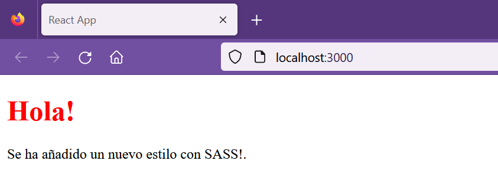

## SASS/LESS vs Styled Components

[Regresar](/CodingBootcampsESPOL-FPR/)


SASS en aplicación React
===========

* * *

SASS es un preprocesador de css. En donde los archivos SASS se ejecutan en el servidor y envían css al navegador. 

Para ejemplicar el uso de SASS en los componentes, crea una aplicación con el comando `create-react-app`. Por otro lado, recordemos que en el inicio se había creado una [aplicación de prueba](../unidad1/nodeJs-npm.md) llamada **todoapp**, en la que también puedes utilizar ese mismo proyecto.

* Ahora instala el paquete de SASS ejecutando el siguiente comando.

```
npm i sass
```
* Crea el archivo my-sass.scss en la que definirá el color del texto para las etiquetas h1.

```css
$myColor: red;

h1 {
  color: $myColor;
}
```
* Ahora se importará el archivo SASS de la misma manera que se incluye un archivo css. Por tal razón, nuestro index.js tiene la siguiente estructura.

```js
import React from 'react';
import ReactDOM from 'react-dom/client';
import './my-sass.scss';

const Header = () => {
  return (
    <>
      <h1>Hola!</h1>
      <p>Se ha añadido un nuevo estilo con SASS!.</p>
    </>
  );
}

const root = ReactDOM.createRoot(document.getElementById('root'));
root.render(<Header />);
```

* Ejecuta el servidor con el siguiente comando, y visualiza los cambios.

```
npm start
```
<p align="center">

</p>

Styled components
===========

* * *

Styled components es una forma de inserción de estilos a una aplicación React utilizando la librería de JavaScript. Entre los ventajas que proporciona el uso de styled components están:

* Css crítico automático.
* Sin errores en los nombres de clase.
* Eliminación fácil de css.
* Estilo dinámico simple.
* Mantenimiento sencillo.

Para utilizar los styled components debes instalar el siguiente paquete ejecutando el comando que se muestra a continuación:

```
npm install styled-components
```
Los styled components utiliza los literales de plantillas con sus respectivas etiquetas y asi diseñar los componentes. Esto quiere decir que está creando un componente React que tiene sus estilos adjuntos.

```js
const Title = styled.h1`
  font-size: 1.5em;
  text-align: center;
  color: palevioletred;
`;


const Wrapper = styled.section`
  padding: 4em;
  background: papayawhip;
`;

render(
  <Wrapper>
    <Title>
      Hello World!
    </Title>
  </Wrapper>
);
```
También se puede hacer uso de  props, visualice el código.

```js
const Button = styled.button`
  background: ${props => props.$primary ? "palevioletred" : "white"};
  color: ${props => props.$primary ? "white" : "palevioletred"};

  font-size: 1em;
  margin: 1em;
  padding: 0.25em 1em;
  border: 2px solid palevioletred;
  border-radius: 3px;
`;

render(
  <div>
    <Button>Normal</Button>
    <Button $primary>Primary</Button>
  </div>
);
```