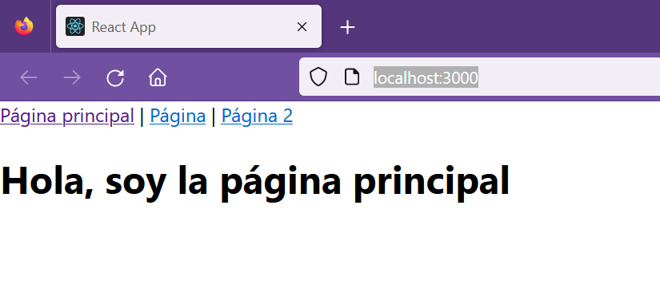
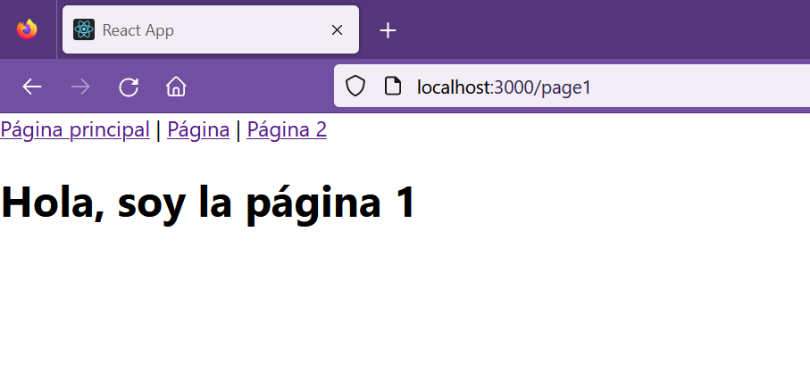
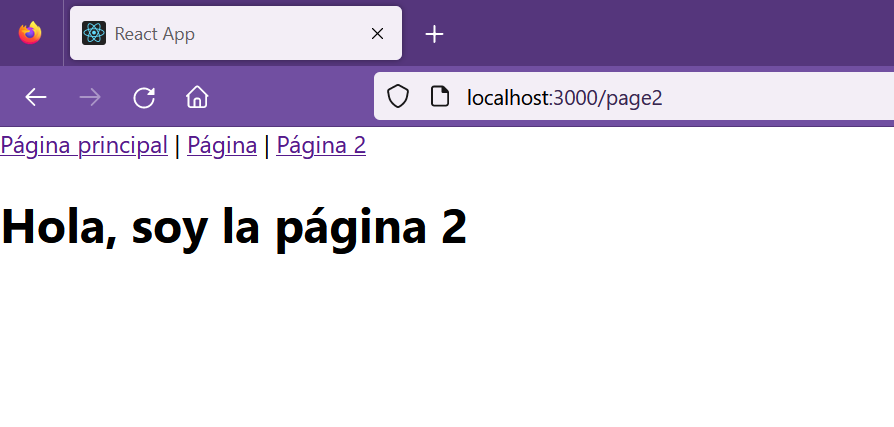

## Enrutamiento básico

[Regresar](/CodingBootcampsESPOL-FPR/)

<span style="color: #188eac"> ¿Qué es enrutamiento? </span>
===========

* * *

El enrutamiento es el proceso de mantener sincronizada la URL con el contenido de una aplicación, y a su vez permite tener el control del flujos de datos de las distintas páginas de la aplicación. A continuación, se mostrará un ejemplo gráfico sobre enrutamiento. 

<p align="center">

</p>

Como observamos en la imagen dependiendo de la ruta se muestra un contenido diferente. 

<p align="center">

</p>

Del código anterior tenemos que:

* Si la URL es igual a `/` se cargará el componente o página **Home**.
* Si la URL es igual a `/shirts/` se cargará el componente o página **Items**.
* Si la URL es igual a `/shirts/10198` se cargará el componente o página **Item**.
* Si la URL es igual a `/pay` se cargará el componente o página **Payment**.
* Si la URL es igual a `/about` se cargará el componente o página **About**.

### Sintaxis básica

En la parte del import la sintaxis que se utiliza se visualiza en la siguiente imagen. 

<p align="center">

</p>

<span style="color: #188eac"> Enrutamiento básico con React Router </span>
===========

* * *

* Iniciamos creando un proyecto React con el siguiente comando.

```
npx create-react-app router-example
```

* Para instalar React Router utilizamos el siguiente comando. Para este ejercicio estaremos usando la versión 5.2.0.

```
npm install react-router-dom@5.2.0
```

* En tu editor de texto de preferencia abre el proyecto **router-example** que acabamos de crear. En el archivo App.js agregamos el siguiente código. 

```js
import React from "react";
import { BrowserRouter as Router, Switch, Route, Link } from "react-router-dom";

function App() {
  return (
    <Router>
      <div>
        <Link to="/">Página principal</Link> | <Link to="/page1">Página</Link> | <Link to="/page2">Página 2</Link>
      </div>

      <Switch>
        <Route path="/page2">
          <h1>Hola, soy la página 2</h1>
        </Route>
        <Route path="/page1">
          <h1>Hola, soy la página 1</h1>
        </Route>
        <Route path="/">
          <h1>Hola, soy la página principal</h1>
        </Route>
      </Switch>
    </Router>
  );
}

export default App;

```

En el código anterior se usa Switch pero cabe recalcar que para la versión actual usan **Routes**. 

* Ejecuta el servidor y verifica el enrutamiento. 

```
npm start
```
<p align="center">

</p>

<p align="center">

</p>

<p align="center">

</p>

## Referencias

* React Router. Retrieved May 09, 2023, from [https://mauriciogc.medium.com/react-react-router-db391b3def2a](https://mauriciogc.medium.com/react-react-router-db391b3def2a)