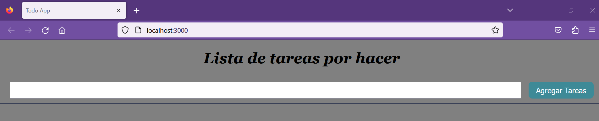

## Hands on exercise - Componentes

[Regresar](/CodingBootcampsESPOL-FPR/)

En está práctica se creará una aplicación que agregará que permitirá agregar tareas pendientes utilizando componentes de React. Descubrirá cómo crear, ver, eliminar, completar, modificar y guardar listas de tareas pendientes.

En esta práctica deberá realizar lo siguiente:

1.	Use un controlador de eventos para crear tareas adicionales.
2.	Eliminación de la tarea completada de la lista de tareas pendientes mediante el método de filtro.
3.	Agrega la función de alternar y la casilla de verificación para verificar la tarea completada o no completada.
4.	Edite una tarea de Todo agregada y envíela usando la función de mapa.
5.	Use el hook UseEffect  para guardar todos nuevos en el almacenamiento local.

* Iniciaremos descompriendo el archivo de [práctica de componentes](../unidad3/todo_list.rar) que se encuentra en sección de recursos de la página inicial.

* Abra la terminal y asegúrese de estar en el directorio todo_list y ejecute el siguiente comando para instalar todos los paquetes necesarios para ejecutar el servidor.

```
npm install
```
* Inicie el servidor usando el siguiente comando en la terminal. Si desea detener el servidor presione Ctrl+c.

```
npm start
```
<p align="center">

</p>

<span style="color: #188eac"> Ejercicio 1: Crear e implementar código para agregar tareas </span>

En el proyecto se encuentra el archivo App.js en el que hay un marcador de posición donde debe agregar la función handlesubmit. Ahora, démosle a la aplicación el poder de agregar una nueva tarea para nuestra aplicación de lista de tareas pendientes. Agregará una función handleSubmit que puede manejar elementos newTodo y agregar la tarea a la lista. La entrada del usuario se valida para garantizar que la entrada no esté vacía y no tenga espacios anteriores o posteriores. 

```js
function handleSubmit(e) {
    e.preventDefault();

    const newTodo = {
      id: new Date().getTime(),
      text: todo.trim(),
      completed: false,
    };
    if (newTodo.text.length > 0 ) {
        setTodos([...todos].concat(newTodo));
        setTodo("");

    } else {

        alert("Ingrese una tarea válida");
        setTodo("");
    }
  }

```

Al enviar el formulario, la tarea se agrega a la matriz de tareas pendientes. El código usa el mapa para iterar a través de la matriz de tareas y representa cada tarea como un elemento de la lista. Usando useState, este componente registra un estado (valor) y una función para actualizarlo (setTodo). El controlador handleSubmit evitará la acción predeterminada que normalmente se tomaría en el formulario y agregará una nueva tarea utilizando el valor más reciente que se encuentra en el campo de entrada.

* Pegue el siguiente código dentro de la función de retorno.

```js
<div id="todo-list">
        <h1>Lista de tareas por hacer</h1>
      <form onSubmit={handleSubmit}>
        <input
            type="text"
            onChange={(e) => setTodo(e.target.value)}
            value={todo}
        />
        <button type="submit">Agregar tarea</button>
        </form>
        {todos.map((todo) => <div className="todo" key={todo.id}>
            <div>{todo.text}</div>
        </div>)}
   </div>

```

* Inicie el servidor e ingrese la tarea válida dentro del cuadro de entrada donde puede ver "Agregar una nueva tarea". Verá la salida de la siguiente manera:

<p align="center">

</p>

<span style="color: #188eac">Ejercicio 2: Eliminar una tarea completada de la lista </span>

La tarea de eliminación se puede manejar de muchas maneras. Ahora escriba el código utilizando el método de filtro que se aplicará cuando se haga clic en un botón. Filtra la tarea a eliminar y devuelve el resto de tareas. El marcador de posición se agrega en el archivo App.js donde debe agregar la función Eliminar para hacer.

```js
 function deleteTodo(id) {
    let updatedTodos = [...todos].filter((todo) => todo.id !== id);
    setTodos(updatedTodos);
  }
```

* Agregue un botón para eliminar la tarea.

```js
<button onClick={() => deleteTodo(todo.id)}>Delete</button>
```

<p align="center">

</p>

* Inicie el servidor, agregue la lista de tareas pendientes y luego intente eliminarla presionando el botón Eliminar. La tarea debe eliminarse de la lista.

<p align="center">

</p>

<span style="color: #188eac">Ejercicio 3: Agregar casilla de verificación y función de alternancia </span>

Ahora agregará una casilla de verificación para marcar la finalización de la tarea. Cree una nueva función, la función toggleComplete que usa el método map para iterar a través de la tarea y marcarla como completa dentro de App.js.

```js
  // Add the toggleComplete code here
  function toggleComplete(id) {
    let updatedTodos = [...todos].map((todo) => {
      if (todo.id === id) {
        todo.completed = !todo.completed;
      }
      return todo;
    });
    setTodos(updatedTodos);
  }

```

* Código para agregar la casilla de verificación encima del botón Eliminar.

```js
<input type="checkbox" id="completed" checked={todo.completed} onChange={() => toggleComplete(todo.id)}/>
```

* Inicie el servidor, agregue la lista de tareas pendientes y luego use la casilla de verificación si la tarea está completa.

<p align="center">

</p>

<span style="color: #188eac">Ejercicio 4: Edite una tarea agregada y envíela </span>

En el ejercicio anterior, agregó la capacidad de alternar la casilla de verificación para la tarea completada en todos. Ahora agregue la funcionalidad para editar la tarea.

* Debe agregar dos estados más para implementar la funcionalidad de edición.

```js
  const [todoEditing, setTodoEditing] = React.useState(null);
  const [editingText, setEditingText] = React.useState("");
```

* Ahora agregue la función enviarEditar en App.js que lo ayudará a enviar la tarea de la lista de tareas pendientes usando la función de mapa.

```js
  // Add the submitEdits code here
  function submitEdits(id) {
    const updatedTodos = [...todos].map((todo) => {
      if (todo.id === id) {
        todo.text = editingText;
        }
        return todo;
      });
      setTodos(updatedTodos);
      setTodoEditing(null);
    }
```

* Solo permitirá ediciones en el modo de edición. Verifique el modo apropiado, luego muestre el formulario de edición donde se puede editar la lista de tareas pendientes y enviarla nuevamente a la lista usando el operador ternario. El formulario de edición tiene un par de botones adicionales para que el usuario pueda controlar entre enviar una edición y eliminar la tarea.

```js
function submitEdits(id) {
  const updatedTodos = [...todos].map((todo) => {
    if (todo.id === id) {
      todo.text = editingText;
      }
      return todo;
    });
    setTodos(updatedTodos);
    setTodoEditing(null);
  }

```

* Inicie el servidor, agregue la lista de tareas pendientes y edítela con el botón Editar.

<p align="center">

</p>

<p align="center">

</p>

<span style="color: #188eac">Ejercicio 5: Agregar el hook useEffect </span>

* Agregará el hook useEffect a su aplicación. Este enlace useEffect será responsable de guardar todos nuevos en el almacenamiento local.

```js
  React.useEffect(() => {
    const json = localStorage.getItem("todos");
    const loadedTodos = JSON.parse(json);
    if (loadedTodos) {
      setTodos(loadedTodos);
    }
  }, []);

  React.useEffect(() => {
    if([todos].length > 0) {
        const json = JSON.stringify(todos);
        localStorage.setItem("todos", json);
    }
  }, [todos]);

```


* Después de poner todo junto, el código final del archivo App.js para la lista de tareas pendientes es el siguiente.

```js
import React from "react";
import "./App.css";

const App = () => {
  const [todos, setTodos] = React.useState([]);
  const [todo, setTodo] = React.useState("");

  const [todoEditing, setTodoEditing] = React.useState(null);
  const [editingText, setEditingText] = React.useState("");

  React.useEffect(() => {
    const json = localStorage.getItem("todos");
    const loadedTodos = JSON.parse(json);
    if (loadedTodos) {
      setTodos(loadedTodos);
    }
  }, []);

  React.useEffect(() => {
    if([todos].length > 0) {
        const json = JSON.stringify(todos);
        localStorage.setItem("todos", json);
    }
  }, [todos]);

  function handleSubmit(e) {
    e.preventDefault();

    const newTodo = {
      id: new Date().getTime(),
      text: todo.trim(),
      completed: false,
    };
    if (newTodo.text.length > 0 ) {
        setTodos([...todos].concat(newTodo));
        setTodo("");

    } else {

        alert("Ingrese tarea válida");
        setTodo("");
    }
  }
  function deleteTodo(id) {
    let updatedTodos = [...todos].filter((todo) => todo.id !== id);
    setTodos(updatedTodos);
  }

  function toggleComplete(id) {
    let updatedTodos = [...todos].map((todo) => {
      if (todo.id === id) {
        todo.completed = !todo.completed;
      }
      return todo;
    });
    setTodos(updatedTodos);
  }

  function submitEdits(id) {
    const updatedTodos = [...todos].map((todo) => {
      if (todo.id === id) {
        todo.text = editingText;
        }
        return todo;
      });
      setTodos(updatedTodos);
      setTodoEditing(null);
    }

    return (
        <div id="todo-list">
          <h1>Lista de tarea por hacer</h1>
          <form onSubmit={handleSubmit}>
            <input
              type="text"
              onChange={(e) => setTodo(e.target.value)}
              value={todo}
            />
            <button type="submit">Agregar tarea</button>
          </form>
          {todos.map((todo) => (
            <div key={todo.id} className="todo">
              <div className="todo-text">
                <input
                  type="checkbox"
                  id="completed"
                  checked={todo.completed}
                  onChange={() => toggleComplete(todo.id)}
                />
                {todo.id === todoEditing ? (
                  <input
                    type="text"
                    onChange={(e) => setEditingText(e.target.value)}
                  />
                ) : (
                  <div>{todo.text}</div>
                )}
              </div>
              <div className="todo-actions">
                {todo.id === todoEditing ? (
                  <button onClick={() => submitEdits(todo.id)}>Enviar</button>
                ) : (
                  <button onClick={() => setTodoEditing(todo.id)}>Editar</button>
                )}

                <button onClick={() => deleteTodo(todo.id)}>Eliminar</button>
              </div>
            </div>
          ))}
        </div>
      );
    };

export default App;

```