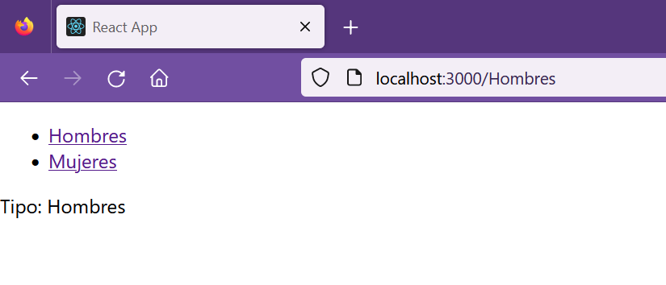

## Parámetros de  rutas

[Regresar](/CodingBootcampsESPOL-FPR/)

Los parámetros en la URL nos ayudan a representar el mismo componente en función de una url dinámica. 

<p align="center">

</p>

Los parámetros se denotan con dos puntos (:), son indicadores de posición en la URL. A continuación se muestra un ejemplo:

<p align="center">

</p>


### Ejemplo de parámetros en rutas

Ejemplificaremos una tienda de ropa, que ofrece ropa de hombres y mujeres y deberá tener las siguientes instrucciones:

* Tener un link para hombres `/Hombres` y un link para mujeres `/Mujeres`.

En el proyecto router-example que habíamos creado en la sección de [enrutamiento básico](./enrutamiento-basico.md), modificamos el archivo App.js.

```js
import React, { Fragment } from "react";
import { BrowserRouter as Router, Switch, Route, Link } from "react-router-dom";
import Clothes from "./components/Clothes.js";

function App() {
  return (
    <Fragment>
      <Router>
        <div>
          <ul>
            <li>
              <Link to="/Hombres">Hombres</Link>
            </li>
            <li>
              <Link to="/Mujeres">Mujeres</Link>
            </li>
          </ul>
        </div>

        <Switch>
          <Route path="/:type">
            <Clothes />
          </Route>
        </Switch>
      </Router>
    </Fragment>
  );
}

export default App;
```

En el código anterior tenemos el componente Router y un atributo `path` que a su vez consta de `/:type` que será el identificador para el componente Clothes.

* Crea la carpeta components y dentro de la misma el archivo Clothes.js con el siguiente código.

```js
import React from "react";
import { useParams } from "react-router-dom";

const Clothes = () => {
  const { type } = useParams();
  return <div>Tipo: {type}</div>;
};

export default Clothes;
```
* Ejecuta el servidor con `npm start` y visualiza el funcionamiento de los parámetros en la ruta que se ha configurado.

<p align="center">

</p>

<p align="center">

</p>

<p align="center">

</p>

## Referencias

* React Router. Retrieved May 09, 2023, from [https://mauriciogc.medium.com/react-react-router-db391b3def2a](https://mauriciogc.medium.com/react-react-router-db391b3def2a)