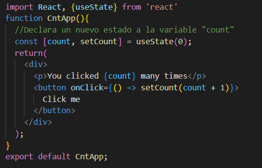

## React Hooks

[Regresar](/CodingBootcampsESPOL-FPR/)

 ¿Qué son los hooks? 
===========

* * *

* Los hooks son una forma más sencilla de encapsular el comportamiento con estado y los efectos secundarios en las interfaces de usuario.
* Los hooks se introdujeron en febrero de 2019 como parte de React 16.8.
* Le ayudan a que su código sea más claro y mejor estructurado.
 Los hooks permiten que los componentes de funciones tengan acceso al estado y otras características de React.
* Son funciones regulares de JavaScript.
* Proporcionan una forma de utilizar funcionalidades como el contexto o el estado, que antes podrían lograr a través de clases, y ahora se puede hacer fácilmente usando componentes de función.

 ¿Por qué usar hooks? 
===========

* * *

* Los hooks resuelven los problemas de tamaño inmanejable de los componentes y las clases confusas al comportarse como funciones que le permiten "enganchar" el estado de React y las características del ciclo de vida de los componentes de la función.
* Los hooks ayudan a simplificar formas complejas sin el uso de clases.
* ¡Y otra gran ventaja de Hooks es que puedes crear tus propios hooks! Esto significa que, en lugar de volver a escribir el código de un componente a otro, puedes escribir un gancho personalizado abstracto y reutilizarlo.

 Ventajas de usar hooks 
===========

* * *

*	Legible
*	Menos código
*	Componente general optimizado
*	Permite escribir un componente funcional con estado
*	Escribir componentes complejos se volvió más fácil
*	Manejo de eventos y lógicas en componentes funcionales
*	Aumento del rendimiento con componentes funcionales

 ¿Cómo usar hooks? 
===========

* * *

* Los hooks solo se pueden llamar dentro de los componentes de la función React. No se puede llamar a hooks desde funciones regulares de Javascript.
* Solo se pueden llamar en el nivel superior de un componente.
* No se puede llamar hooks dentro de bucles, condiciones o funciones anidadas.
* Los hooks utilizan la plataforma JavaScript Node versión 6. Además, utilizan NPM versión 5.2 o superior.

 Hooks estándar 
===========

* * *

* **useState** es un hook que le permite usar el estado en su función. Agrega estado a un componente de función.
* **useEffect** administra efectos secundarios como cambios en documentos, HTTP, etc. Por ejemplo, si necesita obtener datos, puede usar el Hook "useEffect".
* **useContext** gestiona los cambios de contexto y proporciona al componente acceso a un contexto.
* **useReducer** gestiona los cambios de estado de Redux.

En el código anterior representa un contador, usa el hook **useState** que se necesita llamar dentro de un componente de función para agregarle un estado local. Además, devuelve un par donde el primer elemento es el valor de estado actual, o valor inicial, y la segunda es una función que nos permite actualizarlo. Después de eso llama a la función desde un controlador de eventos.

 Hooks personalizados 
===========

* * *

* Son herramientas esenciales que le permiten agregar una funcionalidad especial y única a sus aplicaciones de React.
* Los hooks personalizados se nombran con "use" como prefijo.
* Un Hook personalizado es una nueva composición de uno o varios Hooks.
