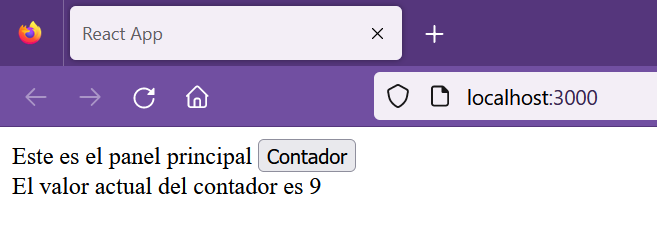

## Hands on exercise - Redux

[Regresar](/CodingBootcampsESPOL-FPR/)

En esta práctica de laboratorio se usará la administración de estado para incrementar el contador usando Redux. Se realizará la gestión de una tienda con Redux que tendrá 3 componentes principales:

* **Acciones:** estos son bloques de información que envían datos desde su aplicación a su tienda. Las acciones deben tener una propiedad de tipo que indique el tipo de acción que se está realizando.

* **Reductores:** los reductores especifican cómo cambia el estado de la aplicación en respuesta a las acciones enviadas a la tienda.

* **Store:** es el objeto que une la acción y el reductor. La tienda tiene las siguientes responsabilidades: mantiene el estado de la aplicación, permite el acceso al estado, permite que el estado se actualice a través del envío (acción).

* En el siguiente laboratorio se usó la versión 9.6.1 de npm por tal razón para actualizarla ejecute el siguiente comando en la consola de comandos. 

```
npm install -g npm@9.6.1
```

* Descomprime el [proyecto base de Redux](./react-redux-master.rar) con el que se estará trabajando. Luego, desde la consola accede a la carpeta donde descomprimió el archivo. 

### Creando la aplicación de contador de incrementos usando Redux en React

* Instale las bibliotecas redux y react-redux para su aplicación usando el siguiente comando. Una vez instalado, verifique si los paquetes requeridos están instalados en el archivo package.json.

```
npm install redux react-redux --no-audit
```

* En esta aplicación que estamos construyendo para aprender el uso de redux con React, tendremos un componente MainPanel que contiene dos componentes internos, MyButton y DivPanel.

    * MyButton es un componente de botón que mantiene un contador onClick. El valor de este contador se mostrará en DivPanel. El contenido de DivPanel se actualizará automáticamente cada vez que cambie el valor del contador.

* En la carpeta src, cree una carpeta llamada acción para definir las acciones de nuestra aplicación. La única acción que va a realizar es incrementar el contador. En la carpeta de acción, cree index.js y pegue el siguiente código que se proporciona a continuación.

```js
const increment = (val) => {
    return {
        type : 'INCREMENT',
        inc : val
    }
}

export default increment;
```

val es el valor por el que desea aumentar el contador cada vez que se hace clic en el botón. Ahora que tiene su acción se define lo que se debe hacer utilizando los reductores.

* En la carpeta src, crea una carpeta llamada reducers. En la carpeta de reductores, cree index.js y pegue el código que se indica a continuación.

```js
import {combineReducers} from 'redux'

const counter = (state=0,action)=>{
    if(action.type === 'INCREMENT') {
        //This will increase the value of counter by the value passed to the increment method
        return state+action.inc;
    }
    //Returns the current value of the counter
    return state;
}

const myReducers = combineReducers({counter});

export default myReducers;
```

* Ahora ya se tiene las acciones y los reductores, se continua creando la tienda. Antes de crear la tienda, se creará los componentes. Por tal razón, crea una carpeta para los componentes denominados components dentro de la carpeta src. Cree el archivo MyButton.js dentro de la carpeta del componente y pegue el código que se proporciona a continuación. 

```js
import React from 'react'
import { useDispatch} from 'react-redux';
import increment from '../actions'

const MyButton = ()=>{
    let dispatch = useDispatch();
    return (
        <button onClick={()=>dispatch(increment(1))}>Contador</button>
    );
}

export default MyButton;
```
useDispatch envía el evento a la tienda y averigua qué acción se debe tomar y usa el reductor apropiado para hacer lo mismo.

*  Ahora creará el archivo DivPanel.js dentro de la carpeta de componentes que contendrá DivPanel donde mostrará el valor del contador.

```js
import React from 'react'
import { useSelector } from 'react-redux';

const DivPanel = () =>{
    let counterVal = useSelector(state => state.counter)
    return (
        <div>
            El valor actual del contador es {counterVal}
        </div>
    );
}

export default DivPanel;
```

useSelector se utiliza para seleccionar el estado de la tienda a cuyo valor desea acceder.

* Ahora se creará MainPanel.js con los dos componentes en el archivo MainPanel.js.

```js
import React from 'react'
import MyButton from './MyButton'
import DivPanel from './DivPanel';

const MainPanel = ()=>{
    return (
        <div>
            Este es el panel principal <MyButton></MyButton>
            <DivPanel></DivPanel>
        </div>
    );
}
export default MainPanel;
```
* Ya creados todos los paneles. Es momento de renderizar el componente MainPanel a través de App.js que tendrá el siguiente código. 

```js
/* Appjs*/
import React from 'react';
import MainPanel from './components/MainPanel';

function App() {
  return (
      <div>
        <MainPanel/>
      </div>
    );
}

export default App;
```

* Ahora realizaremos la configuración final de nuestra aplicacion en React. Se debe crear y configurar la tienda, donde se pueden administrador los estados. Esta configuración la realizaremos en el archivo index.js.

```js
import React from 'react';
import ReactDOM from 'react-dom';
import App from './App';
// import * as serviceWorker from './serviceWorker';

import {createStore} from 'redux';
import {Provider} from 'react-redux'
import myReducers from './reducers'


//Create the store
const myStore = createStore(myReducers);

//This will console log the current state everytime the state changes
myStore.subscribe(()=>console.log(myStore.getState()));

//Enveloping the App inside the Provider, ensures that the states in the store are available
//throughout the application
ReactDOM.render(<Provider store={myStore}><App/></Provider>, document.getElementById('root'));

// If you want your app to work offline and load faster, you can change
// unregister() to register() below. Note this comes with some pitfalls.
// Learn more about service workers: https://bit.ly/CRA-PWA
// serviceWorker.unregister();
```

* En la terminal se debe asegurar que este en la carpeta de nuestro proyecto y de ahí ejecutar el siguiente comando para iniciar el servidor y ejecutar la aplicación.

```
npm start
```

* En el navegador se accederá a la página de [http://localhost:3000/](http://localhost:3000/) 

<p align="center">

</p>